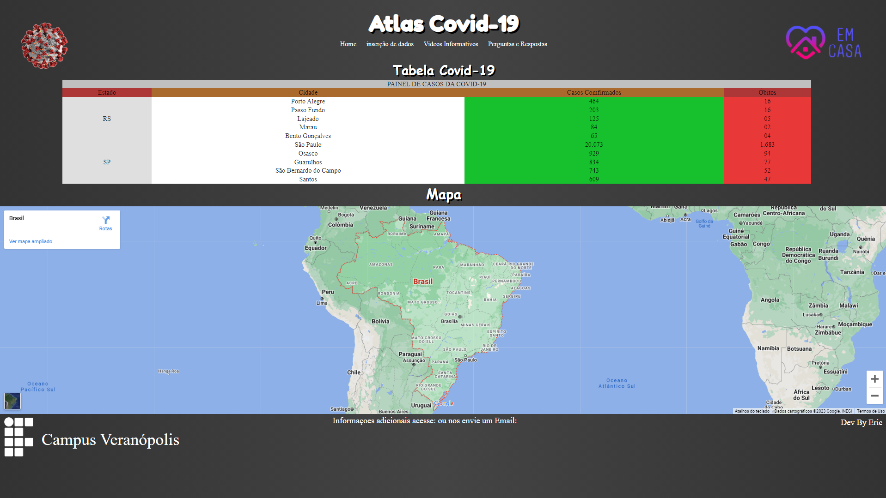

# Atlas Covid
Um Projeto Desenvolvido Com O Intuito De Praticar O Uso De HTML E CSS, Para Isso Foi Criado Um Site Com Informaçoes Sobre A Covid-19.

Na Imagem Acima Podemos Ver Uma Tabela Com Informações Sobre A Covid-19, Como O Número De Casos E Mortes Nas Cidades Rio Grande Do Sul E São Paulo. Também Temos Um Mapa Incorporado. Além Disso, Temos Links Para Outras Páginas Com Um Formulário, Vídeos Informativos E Perguntas Frequentes.

